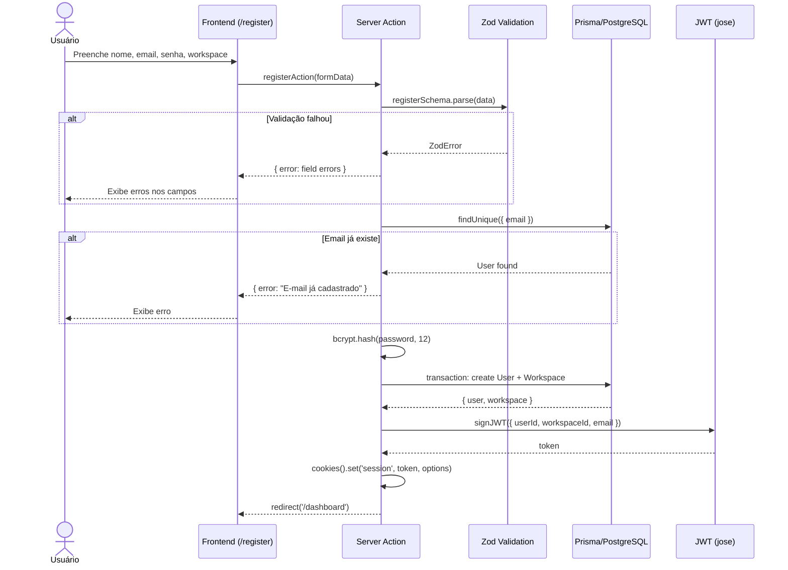
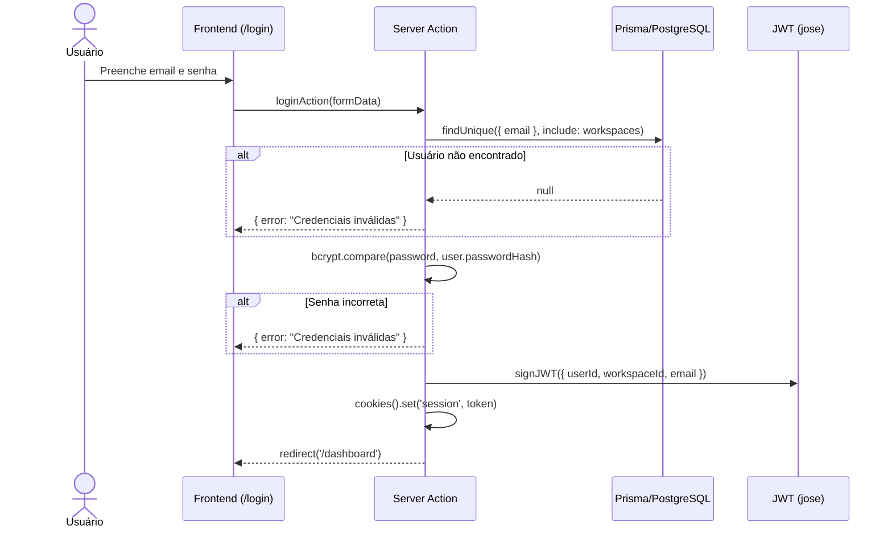
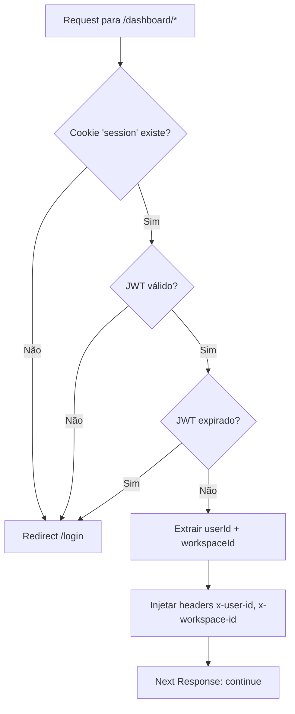
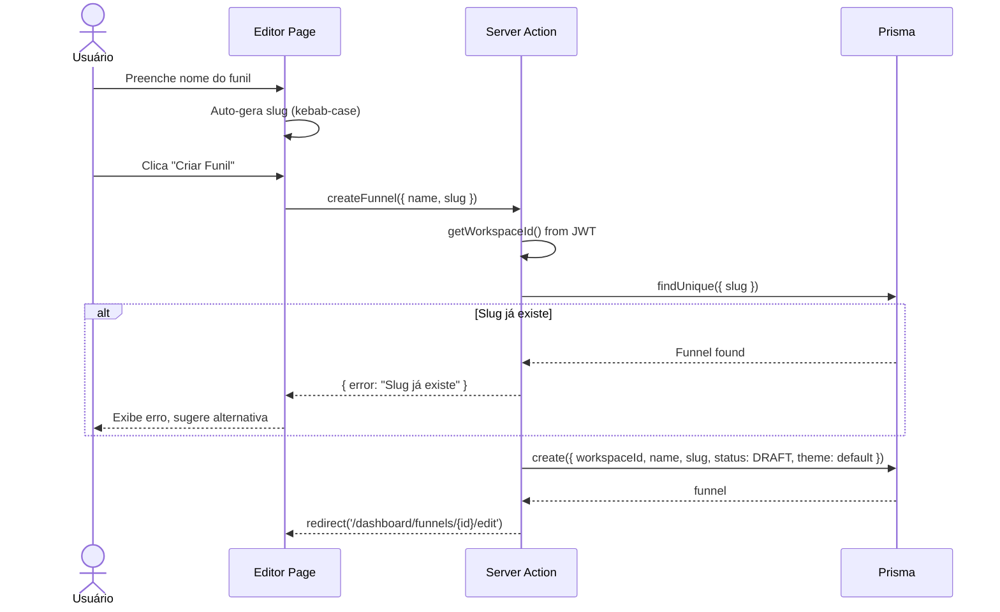
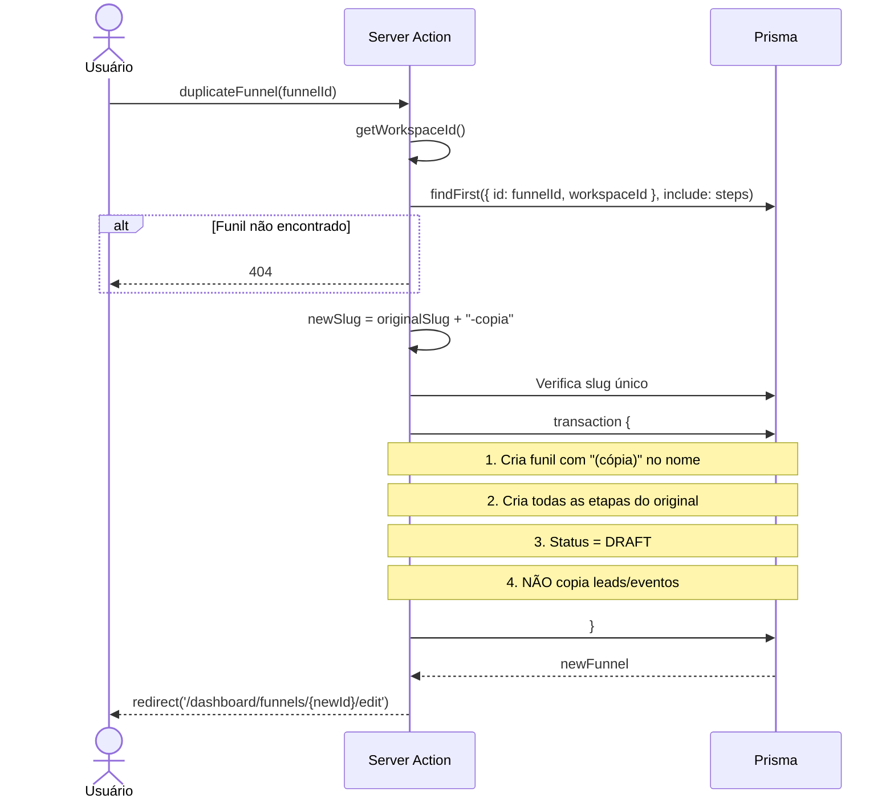
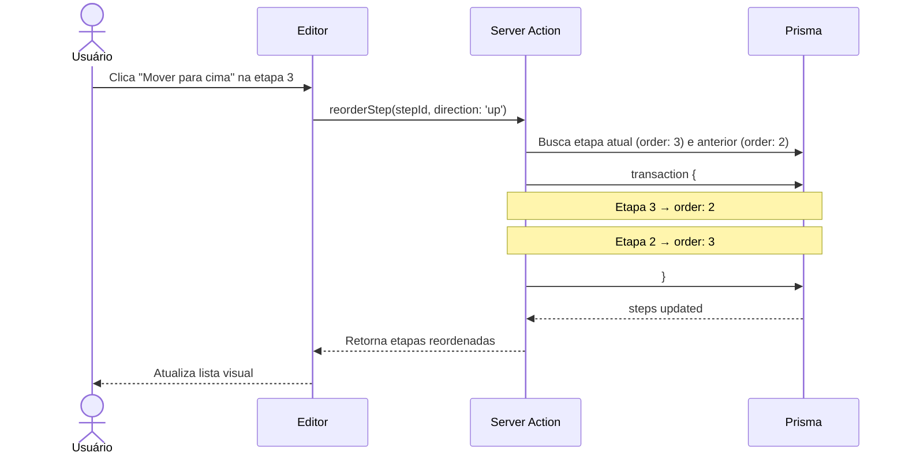
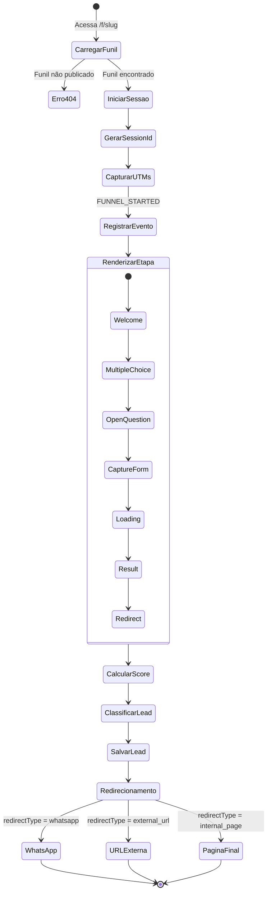
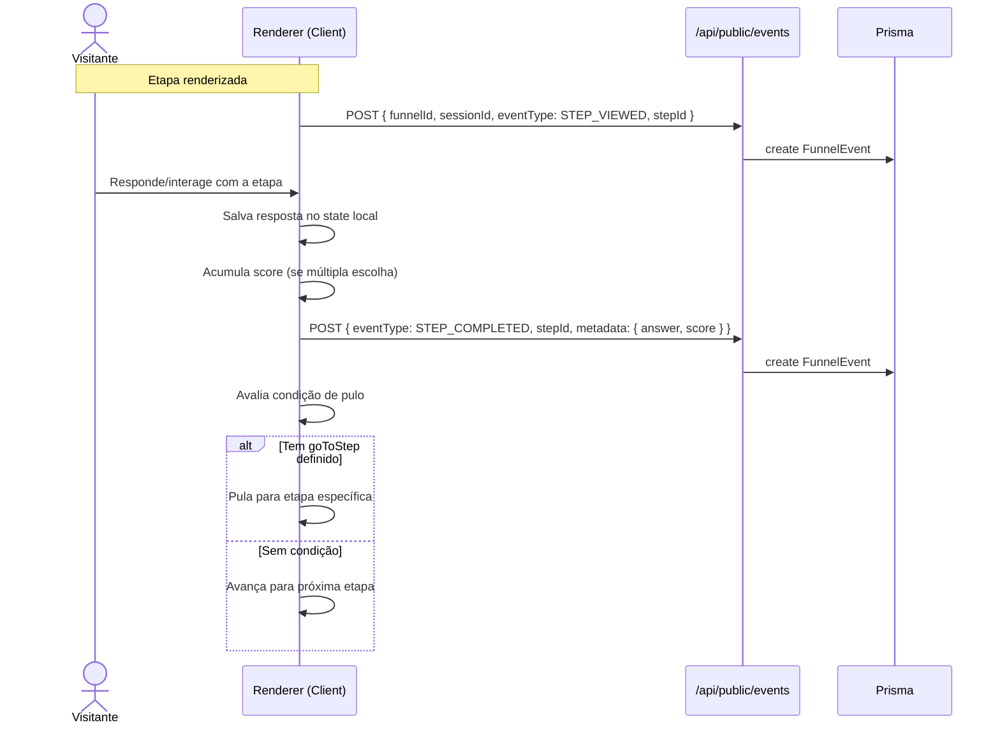
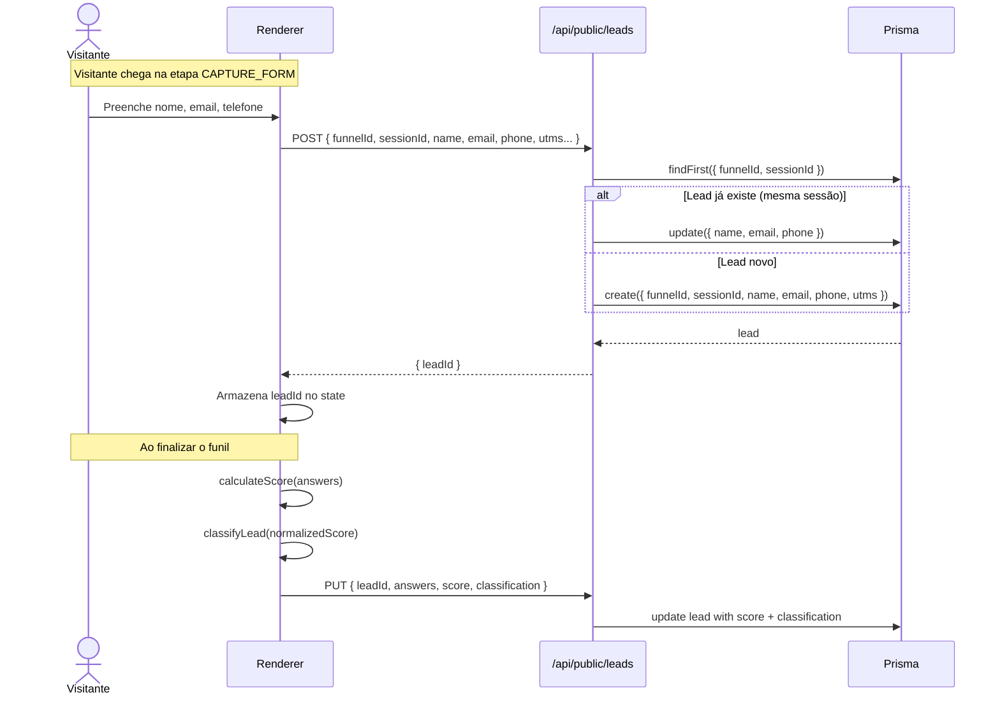

# Spec Driven — Fluxos de Negócio e Regras

> **Versão:** 1.0.0  
> **Data:** 2026-06-24  
> **Status:** Draft  

---

## 1. Fluxo de Autenticação

### 1.1 Registro



### 1.2 Login



### 1.3 Middleware de Proteção



---

## 2. Fluxo de Gestão de Funis

### 2.1 Criação de Funil



### 2.2 Publicação de Funil

```mermaid
flowchart TD
    A[Usuário clica "Publicar"] --> B{Funil tem ≥ 1 etapa?}
    B -- Não --> C[Erro: "Adicione pelo menos 1 etapa"]
    B -- Sim --> D[Atualiza status → PUBLISHED]
    D --> E[Exibe link público: /f/slug]
    E --> F[Botão "Copiar Link"]
    
    G[Usuário clica "Despublicar"] --> H[Atualiza status → DRAFT]
    H --> I[Funil retorna 404 na URL pública]
```

### 2.3 Duplicação de Funil



---

## 3. Fluxo do Editor de Etapas

### 3.1 Adição de Etapa

```mermaid
flowchart TD
    A[Usuário clica "Adicionar Etapa"] --> B[Abre modal de seleção]
    B --> C{Tipo selecionado}
    C --> D[WELCOME]
    C --> E[MULTIPLE_CHOICE]
    C --> F[OPEN_QUESTION]
    C --> G[CAPTURE_FORM]
    C --> H[LOADING]
    C --> I[RESULT]
    C --> J[REDIRECT]
    
    D --> K[Cria etapa com order = último + 1]
    E --> K
    F --> K
    G --> K
    H --> K
    I --> K
    J --> K
    
    K --> L[Abre formulário de configuração]
    L --> M[Usuário configura campos]
    M --> N[Salva config como JSON]
    N --> O[Atualiza lista de etapas]
```

### 3.2 Reordenação de Etapas



---

## 4. Fluxo do Funil Público

### 4.1 Experiência do Visitante



### 4.2 Tracking de Eventos por Etapa



### 4.3 Captura Progressiva de Lead



---

## 5. Regras de Negócio Detalhadas

### 5.1 Regras de Acesso

| Regra | Descrição | Implementação |
|---|---|---|
| RN-001 | Usuário só acessa dados do próprio workspace | `workspaceId` em todas as queries |
| RN-002 | Funil público só é acessível se status = PUBLISHED | Validação em `/f/[slug]` |
| RN-003 | Slug de funil é único globalmente | Constraint unique + validação na aplicação |
| RN-004 | Rotas `/dashboard/*` requerem autenticação | Middleware JWT |
| RN-005 | Dados sensíveis (IP, user agent) são opcionais | Captura controlável |

### 5.2 Regras de Funil

| Regra | Descrição | Implementação |
|---|---|---|
| RN-010 | Funil é criado com status DRAFT | Default no schema |
| RN-011 | Publicação requer ≥ 1 etapa | Validação na server action |
| RN-012 | Slug auto-gerado do nome (kebab-case) | Função `generateSlug()` |
| RN-013 | Slug deve conter apenas `[a-z0-9-]` | Regex validation no Zod |
| RN-014 | Duplicação não copia leads/eventos | Lógica na server action |
| RN-015 | Exclusão remove tudo (cascade) | onDelete: Cascade no Prisma |

### 5.3 Regras de Pontuação

| Regra | Descrição | Implementação |
|---|---|---|
| RN-020 | Score calculado pela soma dos pesos das respostas | `calculateScore()` |
| RN-021 | Score normalizado para 0-100 | `normalizeScore()` |
| RN-022 | Classificação: 0-30 Frio, 31-60 Morno, 61-85 Quente, 86-100 Muito Quente | `classifyLead()` |
| RN-023 | Apenas MULTIPLE_CHOICE contribui para score | Filtro por `stepType` |
| RN-024 | Score 0 se não há perguntas com pontuação | Retorno default |

### 5.4 Regras de Lead

| Regra | Descrição | Implementação |
|---|---|---|
| RN-030 | Lead é identificado por `funnelId + sessionId` | Upsert no capture |
| RN-031 | Lead pode ser criado parcialmente | Campos opcionais no schema |
| RN-032 | Lead é atualizado ao finalizar (score, classificação) | Update no completion |
| RN-033 | UTMs capturados da URL ao iniciar | `useUtm()` hook |
| RN-034 | SessionId gerado no cliente (UUID) | `crypto.randomUUID()` |
| RN-035 | Um visitante = um sessionId por funil | SessionStorage scoped |

### 5.5 Regras de Eventos

| Regra | Descrição | Implementação |
|---|---|---|
| RN-040 | Evento registrado ao visualizar cada etapa | STEP_VIEWED |
| RN-041 | Evento registrado ao completar cada etapa | STEP_COMPLETED |
| RN-042 | Evento de início registrado ao carregar funil | FUNNEL_STARTED |
| RN-043 | Evento de conclusão ao finalizar funil | FUNNEL_COMPLETED |
| RN-044 | Evento de captura ao salvar dados do lead | LEAD_CAPTURED |
| RN-045 | Evento de redirect ao clicar no CTA | REDIRECT_CLICKED |

### 5.6 Regras de WhatsApp

| Regra | Descrição | Implementação |
|---|---|---|
| RN-050 | Número WhatsApp configurável por funil | Campo no Funnel |
| RN-051 | Mensagem aceita variáveis com `{{variavel}}` | Template engine simples |
| RN-052 | Link formato: `wa.me/55NUMERO?text=MSG` | `buildWhatsAppUrl()` |
| RN-053 | Variáveis: nome, email, telefone, pontuacao, classificacao, funil | Substituição dinâmica |
| RN-054 | Link abre em nova aba | `target="_blank"` |

### 5.7 Regras de Templates

| Regra | Descrição | Implementação |
|---|---|---|
| RN-060 | Templates são funis marcados com `isTemplate = true` | Flag no Funnel |
| RN-061 | "Usar template" cria cópia editável no workspace | Clone de funil + steps |
| RN-062 | Templates populados via seed | `prisma/seed.ts` |
| RN-063 | Templates não aparecem na lista de funis do usuário | Filtro `isTemplate: false` |
| RN-064 | Funil criado de template é independente do template | Cópia completa |

---

## 6. Tratamento de Erros

### 6.1 Erros de Autenticação

| Código | Situação | Mensagem (PT-BR) | Ação |
|---|---|---|---|
| 400 | Dados inválidos | Erros específicos por campo | Exibir inline |
| 401 | Credenciais inválidas | "E-mail ou senha incorretos" | Exibir no form |
| 401 | Token expirado | — | Redirect para /login |
| 409 | Email já cadastrado | "Este e-mail já está cadastrado" | Exibir inline |
| 429 | Rate limit excedido | "Muitas tentativas. Tente novamente em X minutos" | Exibir no form |

### 6.2 Erros de Funil

| Código | Situação | Mensagem | Ação |
|---|---|---|---|
| 400 | Slug inválido | "Slug deve conter apenas letras minúsculas, números e hífens" | Inline |
| 400 | Publicar sem etapas | "Adicione pelo menos 1 etapa antes de publicar" | Toast |
| 404 | Funil não encontrado | "Funil não encontrado" | Página 404 |
| 409 | Slug duplicado | "Este slug já está em uso. Tente outro." | Inline |

### 6.3 Erros de Funil Público

| Código | Situação | Mensagem | Ação |
|---|---|---|---|
| 404 | Funil não publicado | "Este funil não está disponível no momento" | Página 404 amigável |
| 500 | Erro ao salvar lead | — | Retry silencioso (3x) |
| 500 | Erro ao registrar evento | — | Fail silently (não bloquear UX) |

---

## 7. Limites e Validações

| Recurso | Limite | Motivo |
|---|---|---|
| Nome do funil | 100 caracteres | UX |
| Slug do funil | 100 caracteres | URL |
| Etapas por funil | 50 | Performance |
| Opções por múltipla escolha | 20 | UX |
| Score por opção | 0-100 | Normalização |
| Duração do loading | 1-10 segundos | UX |
| Campos no formulário de captura | 10 | UX |
| Mensagem WhatsApp | 1000 caracteres | Limite WhatsApp |
| Leads por página (listagem) | 20 | Performance |
| Funis por página (listagem) | 20 | Performance |

---

## 8. WhatsApp — Motor de Templates

### 8.1 Processamento de Variáveis

```typescript
// lib/whatsapp.ts

interface WhatsAppData {
  nome?: string
  email?: string
  telefone?: string
  empresa?: string
  cidade?: string
  pontuacao?: number
  classificacao?: string
  funil?: string
}

/**
 * Substitui variáveis na mensagem do WhatsApp
 */
export function processWhatsAppMessage(
  template: string,
  data: WhatsAppData
): string {
  const variables: Record<string, string> = {
    '{{nome}}': data.nome || '',
    '{{email}}': data.email || '',
    '{{telefone}}': data.telefone || '',
    '{{empresa}}': data.empresa || '',
    '{{cidade}}': data.cidade || '',
    '{{pontuacao}}': data.pontuacao?.toString() || '0',
    '{{classificacao}}': data.classificacao || '',
    '{{funil}}': data.funil || '',
  }

  let message = template
  for (const [variable, value] of Object.entries(variables)) {
    message = message.replaceAll(variable, value)
  }

  return message
}

/**
 * Gera a URL completa do WhatsApp
 */
export function buildWhatsAppUrl(
  phoneNumber: string,
  message: string
): string {
  // Remove tudo que não é número
  const cleanNumber = phoneNumber.replace(/\D/g, '')
  
  // Garante DDI 55 (Brasil)
  const fullNumber = cleanNumber.startsWith('55') 
    ? cleanNumber 
    : `55${cleanNumber}`
  
  const encodedMessage = encodeURIComponent(message)
  
  return `https://wa.me/${fullNumber}?text=${encodedMessage}`
}
```

### 8.2 Exemplo Completo

**Template configurado:**
```
Olá, meu nome é {{nome}}. Acabei de preencher o diagnóstico "{{funil}}" e minha classificação foi {{classificacao}}. Meu score é {{pontuacao}}/100.
```

**Dados do lead:**
```json
{
  "nome": "João Silva",
  "funil": "Diagnóstico de Marketing Digital",
  "classificacao": "Quente",
  "pontuacao": 78
}
```

**Resultado:**
```
Olá, meu nome é João Silva. Acabei de preencher o diagnóstico "Diagnóstico de Marketing Digital" e minha classificação foi Quente. Meu score é 78/100.
```

**URL gerada:**
```
https://wa.me/5511999999999?text=Ol%C3%A1%2C%20meu%20nome%20%C3%A9%20Jo%C3%A3o%20Silva...
```

---

## 9. UTM — Captura e Persistência

### 9.1 Parâmetros Suportados

| Parâmetro | Exemplo | Uso |
|---|---|---|
| `utm_source` | `google`, `facebook`, `instagram` | Origem do tráfego |
| `utm_medium` | `cpc`, `social`, `email` | Meio/canal |
| `utm_campaign` | `lancamento-curso`, `black-friday` | Nome da campanha |
| `utm_content` | `banner-azul`, `video-1` | Variação do anúncio |
| `utm_term` | `marketing+digital`, `agencia` | Palavra-chave |

### 9.2 Fluxo de Captura

```typescript
// hooks/use-utm.ts
export function useUtm() {
  const searchParams = useSearchParams()
  
  return {
    utmSource: searchParams.get('utm_source'),
    utmMedium: searchParams.get('utm_medium'),
    utmCampaign: searchParams.get('utm_campaign'),
    utmContent: searchParams.get('utm_content'),
    utmTerm: searchParams.get('utm_term'),
  }
}
```

### 9.3 URL de Exemplo

```
https://app.leadflow.ai/f/diagnostico-marketing?utm_source=facebook&utm_medium=cpc&utm_campaign=lancamento-q3&utm_content=video-depoimento
```
