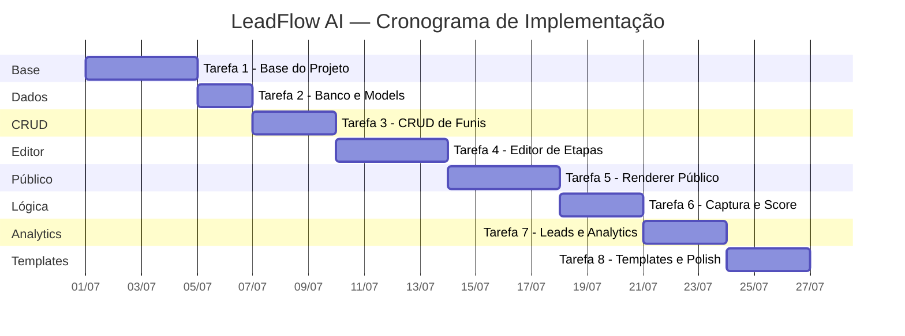

# Spec Driven — Plano de Implementação por Tarefas

> **Versão:** 1.0.0  
> **Data:** 2026-06-24  
> **Status:** Draft  

---

## Visão Geral

O MVP do LeadFlow AI será implementado em **8 tarefas sequenciais**, cada uma construindo sobre a anterior. Cada tarefa é auto-contida e deve resultar em funcionalidade testável.



---

## Tarefa 1 — Base do Projeto

### Objetivo
Criar a estrutura do projeto Next.js, configurar Tailwind CSS, Prisma, PostgreSQL (Supabase), autenticação e layout base do dashboard.

### Entregáveis

| Item | Arquivo/Diretório |
|---|---|
| Projeto Next.js (App Router) | `/` |
| Configuração TypeScript | `tsconfig.json` |
| Configuração Tailwind CSS | `tailwind.config.ts`, `globals.css` |
| Configuração Prisma | `prisma/schema.prisma` |
| Conexão Supabase | `.env.example`, `.env.local` |
| Auth: register, login, logout | `src/actions/auth.ts` |
| Middleware de proteção | `middleware.ts` |
| Layout dashboard (sidebar + header) | `src/app/(dashboard)/layout.tsx` |
| Layout auth (login/register) | `src/app/(auth)/` |
| Componentes UI base | `src/components/ui/` |
| Página vazia do dashboard | `src/app/(dashboard)/dashboard/page.tsx` |
| Landing page simples | `src/app/page.tsx` |
| README com instruções | `README.md` |
| `.env.example` | `.env.example` |
| `.gitignore` | `.gitignore` |

### Detalhamento

#### 1.1 Setup do projeto
```bash
npx -y create-next-app@latest ./ --typescript --tailwind --eslint --app --src-dir --import-alias "@/*" --no-turbopack
```

#### 1.2 Instalar dependências
```bash
npm install @prisma/client bcryptjs jose zod react-hook-form @hookform/resolvers recharts clsx tailwind-merge lucide-react
npm install -D prisma @types/bcryptjs ts-node
```

#### 1.3 Componentes UI a criar
- `Button` — variantes: primary, secondary, ghost, danger, outline
- `Card` — container com sombra e borda
- `Input` — com label, erro, ícone
- `Badge` — para classificações
- `Modal` — confirmação e diálogos
- `Spinner` — loading indicator
- `Toast` — notificações

#### 1.4 Layout do Dashboard
- Sidebar com navegação (Dashboard, Funis, Leads, Templates)
- Header com breadcrumbs e user menu
- Main content area responsiva
- Mobile: sidebar colapsa em hamburger menu

#### 1.5 Critérios de Aceite
- [ ] Projeto roda com `npm run dev`
- [ ] Login e cadastro funcionam
- [ ] Dashboard protegido (redirect se não logado)
- [ ] Layout do dashboard renderiza corretamente
- [ ] Sidebar com navegação funcional
- [ ] Responsivo em mobile

---

## Tarefa 2 — Banco e Models

### Objetivo
Definir o schema Prisma completo, rodar migration inicial e criar seed básico.

### Entregáveis

| Item | Arquivo |
|---|---|
| Schema completo | `prisma/schema.prisma` |
| Migration inicial | `prisma/migrations/001_init/` |
| Prisma client singleton | `src/lib/prisma.ts` |
| Seed básico | `prisma/seed.ts` |
| Types TypeScript | `src/types/` |

### Detalhamento

#### 2.1 Models
- User, Workspace, Funnel, FunnelStep, Lead, FunnelEvent
- Enums: FunnelStatus, StepType, Classification, EventType
- Índices conforme spec

#### 2.2 Prisma Client (Singleton)
```typescript
// src/lib/prisma.ts
import { PrismaClient } from '@prisma/client'

const globalForPrisma = globalThis as unknown as { prisma: PrismaClient }

export const prisma = globalForPrisma.prisma || new PrismaClient()

if (process.env.NODE_ENV !== 'production') globalForPrisma.prisma = prisma
```

#### 2.3 Seed Básico
- Criar usuário admin de teste
- Criar workspace de teste
- (Templates serão adicionados na Tarefa 8)

#### 2.4 Critérios de Aceite
- [ ] `npx prisma migrate dev` roda sem erros
- [ ] `npx prisma db seed` popula dados de teste
- [ ] `npx prisma studio` mostra tabelas corretas
- [ ] Types TypeScript exportados e funcionais
- [ ] Prisma client funciona em server components

---

## Tarefa 3 — CRUD de Funis

### Objetivo
Implementar listagem, criação, edição, duplicação, publicação e exclusão de funis.

### Entregáveis

| Item | Arquivo |
|---|---|
| Listagem de funis | `src/app/(dashboard)/dashboard/funnels/page.tsx` |
| Criação de funil | `src/app/(dashboard)/dashboard/funnels/new/page.tsx` |
| Edição de funil (settings) | `src/app/(dashboard)/dashboard/funnels/[id]/edit/page.tsx` |
| Server actions de funil | `src/actions/funnels.ts` |
| Zod schemas de funil | `src/schemas/funnel.ts` |
| Componentes de funil | `src/components/funnels/` |
| Workspace guard | `src/lib/workspace.ts` |
| Slug generator | `src/lib/slug.ts` |

### Detalhamento

#### 3.1 Server Actions
```typescript
// src/actions/funnels.ts
createFunnel(data)      // Cria funil no workspace
updateFunnel(id, data)  // Atualiza funil
deleteFunnel(id)        // Exclui funil (cascade)
duplicateFunnel(id)     // Duplica com etapas
publishFunnel(id)       // Publica funil
unpublishFunnel(id)     // Despublica funil
```

#### 3.2 Componentes
- `FunnelList` — grid/lista de funis com busca e filtros
- `FunnelCard` — card individual com ações
- `FunnelForm` — formulário de criação/edição
- `FunnelSettings` — painel de configurações (nome, slug, WhatsApp, tema)

#### 3.3 Critérios de Aceite
- [ ] Listar funis do workspace
- [ ] Criar funil com nome e slug
- [ ] Editar nome, slug, WhatsApp
- [ ] Duplicar funil com todas etapas
- [ ] Publicar/despublicar funil
- [ ] Excluir funil com confirmação
- [ ] Buscar e filtrar funis
- [ ] Copiar link público

---

## Tarefa 4 — Editor de Etapas

### Objetivo
Criar o editor de etapas do funil com formulários de configuração por tipo.

### Entregáveis

| Item | Arquivo |
|---|---|
| Editor de etapas | Integrado na página de edição |
| Componentes por tipo | `src/components/editor/step-types/` |
| Server actions de etapas | `src/actions/steps.ts` |
| Zod schemas de etapas | `src/schemas/step.ts` |

### Detalhamento

#### 4.1 Editor Principal
- Lista vertical de etapas com preview
- Botão "Adicionar etapa" com seletor de tipo
- Cada etapa: expandir/colapsar, mover, editar, deletar
- Formulário de configuração por tipo

#### 4.2 Formulários de Configuração
| Tipo | Campos |
|---|---|
| WELCOME | título, subtítulo, imagem, botão |
| MULTIPLE_CHOICE | título, descrição, opções (texto + score + variável + goToStep) |
| OPEN_QUESTION | título, tipo de campo, placeholder, obrigatório |
| CAPTURE_FORM | campos ativáveis (nome, email, telefone, etc) |
| LOADING | texto, duração |
| RESULT | título, texto, mostrar score/classificação, resultados condicionais |
| REDIRECT | tipo, URL/WhatsApp/página |

#### 4.3 Server Actions
```typescript
createStep(funnelId, data)       // Adiciona etapa
updateStep(stepId, data)         // Atualiza configuração
deleteStep(stepId)               // Remove etapa
reorderSteps(funnelId, stepIds)  // Reordena
```

#### 4.4 Critérios de Aceite
- [ ] Adicionar todos os 7 tipos de etapa
- [ ] Configurar cada tipo com seus campos específicos
- [ ] Mover etapas para cima/baixo
- [ ] Remover etapas com confirmação
- [ ] Salvar configuração como JSON
- [ ] Preview visual de cada etapa
- [ ] Validação com Zod em cada formulário

---

## Tarefa 5 — Renderer Público

### Objetivo
Criar a página pública `/f/[slug]` que renderiza o funil para visitantes.

### Entregáveis

| Item | Arquivo |
|---|---|
| Página pública | `src/app/f/[slug]/page.tsx` |
| Renderer principal | `src/components/renderer/funnel-renderer.tsx` |
| Renderers por tipo | `src/components/renderer/step-renderers/` |
| Barra de progresso | `src/components/renderer/progress-indicator.tsx` |
| Theme provider | `src/components/renderer/funnel-theme-provider.tsx` |
| Hook de sessão | `src/hooks/use-funnel-session.ts` |
| Hook de UTM | `src/hooks/use-utm.ts` |

### Detalhamento

#### 5.1 Página Server Component
```typescript
// src/app/f/[slug]/page.tsx
// Carrega funil por slug (server-side)
// Valida se está publicado
// Retorna 404 se não
// Passa dados para FunnelRenderer (client component)
```

#### 5.2 FunnelRenderer (Client Component)
- State machine: currentStep, answers, score
- Gera sessionId
- Captura UTMs
- Navega entre etapas
- Avalia condições de pulo
- Calcula score progressivo

#### 5.3 Renderers por Tipo
| Renderer | Comportamento |
|---|---|
| WelcomeRenderer | Exibe título, subtítulo, imagem, botão iniciar |
| MultipleChoiceRenderer | Exibe opções como cards clicáveis, selecionar avança |
| OpenQuestionRenderer | Exibe input por tipo, botão continuar |
| CaptureFormRenderer | Exibe formulário, valida, salva lead |
| LoadingRenderer | Exibe animação por N segundos, auto-avança |
| ResultRenderer | Calcula score, exibe resultado condicional |
| RedirectRenderer | Redireciona automaticamente |

#### 5.4 UX do Funil Público
- Mobile-first (experiência quiz-like)
- Container centralizado (max-width 480px)
- Transição suave entre etapas (fade/slide)
- Barra de progresso no topo
- Tema visual aplicado (cores, fonte, modo)
- Botão voltar (etapa anterior)

#### 5.5 Critérios de Aceite
- [ ] Acessar `/f/slug` carrega funil publicado
- [ ] 404 para funil não publicado ou inexistente
- [ ] Todas as etapas renderizam corretamente
- [ ] Navegação entre etapas funciona
- [ ] Barra de progresso atualiza
- [ ] Tema visual é aplicado
- [ ] Design responsivo (mobile-first)
- [ ] Transições suaves
- [ ] Funciona sem erros no console

---

## Tarefa 6 — Captura e Score

### Objetivo
Implementar captura de leads, cálculo de pontuação, classificação automática e link WhatsApp.

### Entregáveis

| Item | Arquivo |
|---|---|
| API de captura de lead | `src/app/api/public/leads/route.ts` |
| API de eventos | `src/app/api/public/events/route.ts` |
| Scoring engine | `src/lib/scoring.ts` |
| WhatsApp builder | `src/lib/whatsapp.ts` |
| UTM extractor | `src/lib/utm.ts` |
| Event tracker | `src/lib/tracking.ts` |

### Detalhamento

#### 6.1 Captura de Lead
- Criar/atualizar lead por `funnelId + sessionId`
- Salvar respostas progressivamente
- Capturar UTMs da URL
- Salvar IP e user agent (opcional)

#### 6.2 Scoring
- `calculateScore(answers)` — soma dos pesos
- `normalizeScore(raw, max)` — escala 0-100
- `classifyLead(score)` — COLD/WARM/HOT/VERY_HOT
- `calculateMaxPossibleScore(steps)` — soma dos máximos

#### 6.3 WhatsApp
- `processWhatsAppMessage(template, data)` — substitui variáveis
- `buildWhatsAppUrl(number, message)` — gera URL completa

#### 6.4 Tracking
- Registrar eventos (FUNNEL_STARTED, STEP_VIEWED, etc.)
- Associar eventos ao sessionId
- Fire-and-forget (não bloquear UX)

#### 6.5 Critérios de Aceite
- [ ] Lead é criado ao preencher formulário de captura
- [ ] Respostas são salvas progressivamente
- [ ] Score é calculado corretamente
- [ ] Classificação é atribuída automaticamente
- [ ] UTMs são capturados e salvos
- [ ] Eventos são registrados por etapa
- [ ] Link WhatsApp gerado com variáveis substituídas
- [ ] Pulo condicional funciona (goToStep)

---

## Tarefa 7 — Leads e Analytics

### Objetivo
Criar painel de leads (listagem + detalhes) e analytics básico por funil.

### Entregáveis

| Item | Arquivo |
|---|---|
| Lista de todos os leads | `src/app/(dashboard)/dashboard/leads/page.tsx` |
| Leads por funil | `src/app/(dashboard)/dashboard/funnels/[id]/leads/page.tsx` |
| Analytics por funil | `src/app/(dashboard)/dashboard/funnels/[id]/analytics/page.tsx` |
| Componentes de leads | `src/components/leads/` |
| Componentes de analytics | `src/components/analytics/` |
| Analytics calculator | `src/lib/analytics.ts` |
| Server actions de leads | `src/actions/leads.ts` |

### Detalhamento

#### 7.1 Painel de Leads
- Tabela com nome, telefone, email, funil, classificação, score, data
- Busca por nome/email/telefone
- Filtro por funil e classificação
- Ordenação por colunas
- Paginação (20/página)
- Detalhe do lead (modal ou página): dados, respostas, UTMs, botão WhatsApp

#### 7.2 Analytics por Funil
- Cards: visitantes, leads, taxa de conversão
- Gráfico de funil por etapa (abandono)
- Pizza: distribuição por classificação
- Barras: leads por dia (últimos 7/30 dias)
- Tabela: UTMs com conversão
- Filtro por período

#### 7.3 Dashboard (atualizar)
- Métricas gerais: funis, visitantes, leads, conversão
- Gráfico de leads dos últimos 7 dias
- Lista de funis recentes

#### 7.4 Critérios de Aceite
- [ ] Listar leads com busca e filtros
- [ ] Ver detalhes completos do lead
- [ ] Botão WhatsApp funcional no detalhe
- [ ] Analytics por funil com 4 visualizações
- [ ] Dashboard com métricas reais
- [ ] Filtro por período funciona
- [ ] Paginação de leads funciona

---

## Tarefa 8 — Templates e Polimento

### Objetivo
Criar templates por nicho, funcionalidade "usar template" e polimento final.

### Entregáveis

| Item | Arquivo |
|---|---|
| Galeria de templates | `src/app/(dashboard)/dashboard/templates/page.tsx` |
| Componentes de templates | `src/components/templates/` |
| Seed de templates | `prisma/seed.ts` (atualizar) |
| Server action de templates | `src/actions/templates.ts` |
| Polimento geral | Múltiplos arquivos |
| README final | `README.md` |
| `.env.example` | `.env.example` |

### Detalhamento

#### 8.1 Templates (6)

**Template 1: Diagnóstico de Marketing Digital**
- Etapas: Boas-vindas → Investimento (MC) → Site (MC) → Objetivo (MC) → Equipe (MC) → Captura → Loading → Resultado
- Pontuação: Cada pergunta com 4 opções (5, 15, 25, 30 pontos)

**Template 2: Simulador de Economia Solar**
- Etapas: Boas-vindas → Tipo imóvel (MC) → Conta de luz (MC) → Região (MC) → Telhado (MC) → Captura → Resultado
- Pontuação: Viabilidade do projeto solar

**Template 3: Qualificação Climatização/HVAC**
- Etapas: Boas-vindas → Tipo projeto (MC) → Ambientes (MC) → Orçamento (MC) → Captura → Loading → Resultado
- Pontuação: Urgência e orçamento

**Template 4: Encontre seu Imóvel Ideal**
- Etapas: Boas-vindas → Objetivo (MC) → Tipo (MC) → Região (MC) → Orçamento (MC) → Captura → Loading → Resultado
- Pontuação: Prontidão para compra

**Template 5: Diagnóstico Empresarial**
- Etapas: Boas-vindas → Faturamento (MC) → Equipe (MC) → Desafio (MC) → Marketing (MC) → Captura → Loading → Resultado
- Pontuação: Maturidade do negócio

**Template 6: Quiz de Lançamento**
- Etapas: Boas-vindas → Pergunta 1 (MC) → Pergunta 2 (MC) → Pergunta 3 (MC) → Captura → Resultado
- Pontuação: Engajamento e qualificação

#### 8.2 Polimento Final
- [ ] Verificar responsividade em todas as páginas
- [ ] Testar fluxo completo (criar funil → publicar → responder → ver lead)
- [ ] Verificar todas as validações
- [ ] Tratar estados vazios (empty states)
- [ ] Loading states em todas as operações
- [ ] Error boundaries
- [ ] Meta tags e SEO básico
- [ ] Favicon e Open Graph
- [ ] README com instruções completas

#### 8.3 Critérios de Aceite
- [ ] 6 templates disponíveis na galeria
- [ ] "Usar template" cria funil editável
- [ ] Seed roda sem erros
- [ ] README com setup completo
- [ ] `.env.example` atualizado
- [ ] Fluxo completo funciona end-to-end
- [ ] Sem erros no console
- [ ] Design responsivo em todas as páginas

---

## Checklist Final de Entrega

### Funcionalidade
- [ ] Cadastro e login funcionam
- [ ] Dashboard mostra métricas reais
- [ ] CRUD completo de funis
- [ ] Editor de 7 tipos de etapa
- [ ] Funil público renderiza corretamente
- [ ] Captura de leads funciona
- [ ] Score e classificação calculados
- [ ] WhatsApp dinâmico funcional
- [ ] Painel de leads com busca e filtros
- [ ] Analytics básico por funil
- [ ] 6 templates por nicho
- [ ] Templates criáveis e editáveis

### Técnico
- [ ] TypeScript sem erros
- [ ] Build sem erros (`npm run build`)
- [ ] Prisma migrations funcionais
- [ ] Seed funcional
- [ ] Variáveis de ambiente documentadas
- [ ] Componentes reutilizáveis
- [ ] Lógica de score separada
- [ ] Validação Zod em todas as entradas
- [ ] Isolamento por workspace
- [ ] README completo

### UX/UI
- [ ] Interface moderna e premium
- [ ] Responsivo em mobile e desktop
- [ ] Loading states em operações assíncronas
- [ ] Feedback visual (toasts, badges, estados)
- [ ] Empty states informativos
- [ ] Transições suaves
- [ ] Cores consistentes
- [ ] Tipografia legível
